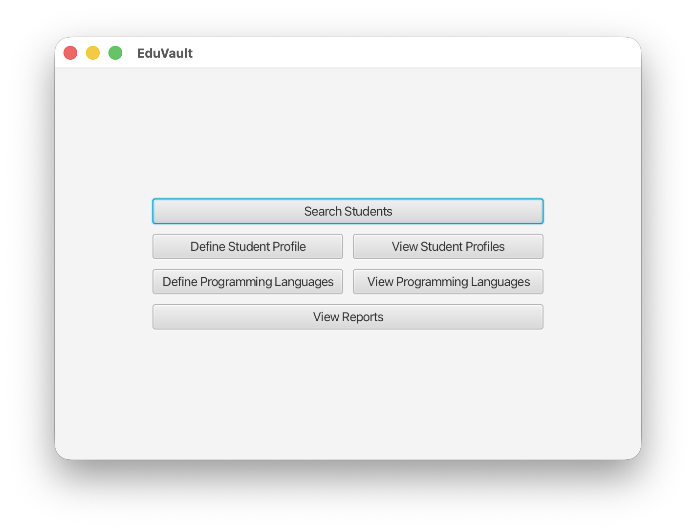
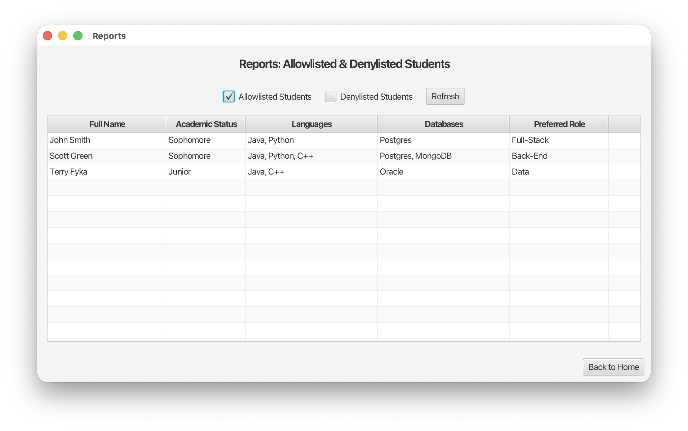

# *EduVault*

Cross-platform software for faculty to manage students

## Overview

EduVault is a comprehensive student management system designed to help faculty efficiently track and manage student information. Built with JavaFX, this desktop application provides an intuitive interface for maintaining student profiles, recording comments, tracking programming language proficiencies, and generating reports for allowlisted and denylisted students. The system supports full CRUD operations, advanced search capabilities, and persistent data storage through CSV files.

## Screenshots

---

## Contribution History

Team project for CS 151 at SJSU with contributions from:

- [Brody Smith](https://brodysmith.com) | **Technical Lead**
- Chloe Pham | **Product Lead**
- Xuan Phuong Nguyen
- Tavishi Bansal

*Note that our versions do not match [semantic versioning](https://semver.org/), because of standards set by our professor.*

### Version 1.0

Brody Smith:

- Updated documentation to reflect latest version of product
- Refactored codebase to follow industry-standard naming conventions (ex: "allowlist" instead of "whitelist") and improve code maintainability

### Version 0.9

Brody Smith:

- Implemented double-click event handling on reports page to enable direct navigation to student detail views
- Designed and developed read-only form layout for displaying comprehensive student information in a secure way
- Fixed UX issue by standardizing title bar behavior across all view transitions

Chloe Pham:

- Implemented double-click event handling on student detail page to display full comment content
- Developed CommentDetailController.java and comment_detail.fxml for expanded comment viewing

Xuan Phuong Nguyen

- Added comment table-view to bottom of student detail page

Tavishi Bansal

- Implemented Reports page (reports.fxml, ReportsController.java) to display allowlisted and denylisted students in tabular format.
- Added “View Reports” button on Home page and integrated navigation to reports page.
- Enabled filtering via checkboxes to toggle between Allowlisted, Denylisted, or both student lists.
- Connected report data dynamically to StudentRepository for real-time updates.

### Version 0.8

Brody Smith:

- Extended SearchController and StudentProfilesController with comment viewing functionality
- Developed student-specific comment viewing interface with corresponding UI template

Chloe Pham:

- Architected Comment.java entity class and CommentRepository.java for comment data management
- Refactored data storage architecture to separate comments into dedicated comments.csv file for improved data organization

Xuan Phuong Nguyen

- Implement add comment feature (StudentCommentsController.java and student_comments.fxml)

Tavishi Bansal

- Modified Comment.java and CommentRepository.java to include a new date field.
- Updated the CSV file format to "FullName, Comment, Date" with quoted values.
- Updated StudentCommentsController.java to:
  - Automatically add today’s date when a new comment is created.
  - Display all comments with their associated date stamps.

### Version 0.7

Brody Smith:

- Conducted repository management and comprehensive code review
- Resolved input validation bug by removing "None" flag assignment for null flag inputs during student profile creation
- Redesigned homepage UI with improved button layout and visual hierarchy

Chloe Pham:

- Implemented view refresh functionality to reflect saved edits on search page
- Developed persistence layer for edited student profiles in EditStudentController.java

Xuan Phuong Nguyen

- Implemented the ability to edit student profiles (SearchController.java)

Tavishi Bansal

- Added "Edit" button that leads to a student editing page (SearchController.java, edit_student.fxml)

### Version 0.6

Brody Smith:

- Developed core search functionality with multi-criteria filtering capabilities
- Enhanced data validation by implementing whitespace trimming for duplicate detection during student profile creation

Chloe Pham:

- Developed student deletion functionality with data integrity safeguards for search page

Xuan Phuong Nguyen

- Made search (name, academic status, programming language, database skill, or role) result appear in tabular format (search.fxml, SearchController.java and HomeController.java)

Tavishi Bansal

- Added “Search Students” Button to Home Screen
- Implemented search.fxml & SearchController.java

### Version 0.5

Brody Smith:

- Architected and implemented StudentController.java with corresponding student.fxml view
- Implemented data integrity features including duplicate detection and bug fixes for student information persistence

Chloe Pham:

- Implemented bidirectional navigation system with forward and back button functionality for StudentController.java and student.fxml

Xuan Phuong Nguyen

- Implemented StudentProfilesController.java, StudentProfile.java, StudentRepository.java, and student_profiles.fxml

Tavishi Bansal

- Implemented StudentProfilesController.java, StudentProfile.java, StudentRepository.java, and student_profiles.fxml
- Implemented storage for student profiles (students.csv)

### Version 0.3

Brody Smith:

- Designed and implemented CSV-based persistent storage backend for programming languages data

Chloe Pham:

- Developed LangTable.java for programming language data structure management

### Version 0.2

Brody Smith:

- Developed ProgrammingLanguagesController.java with full CRUD operations for language management

Chloe Pham:

- Designed and implemented programming_languages.fxml UI layout for language management interface

Xuan Phuong Nguyen

- Implemented HomeController.java

Tavishi Bansal

- Implemented home.fxml
